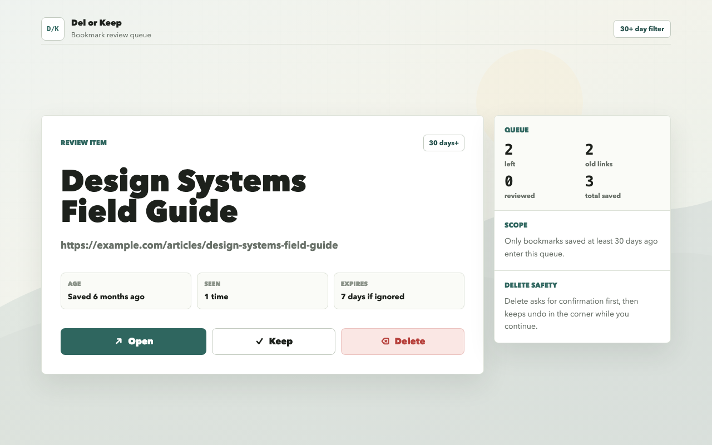

# Del or Keep

Language: English | [繁體中文](README.zh-Hant.md)

Del or Keep is a Manifest V3 Chrome extension that turns the new tab page into a lightweight bookmark review queue. It shows one bookmark saved at least 30 days ago and lets the user open, keep, or delete it with confirmation and undo.



## Features

- Reviews one old bookmark at a time from the Chrome new tab page.
- Lets users open a bookmark before deciding.
- Supports keep, delete with confirmation, and undo for a recent delete.
- Keeps review state local in Chrome extension storage.
- Uses the Bing daily image endpoint only for the new tab background.

## Install From GitHub Releases

Del or Keep is not yet available from the Chrome Web Store. Until the store listing is available, install the GitHub release as an unpacked extension:

1. Download `del-or-keep-<version>.zip` from the latest GitHub Release.
2. Unzip the archive and keep the extracted folder in a stable location.
3. Open `chrome://extensions`.
4. Enable Developer mode.
5. Click Load unpacked and select the extracted folder.

Chrome loads unpacked extensions from the selected folder, so do not delete the extracted folder while using the extension.

## Development

```sh
pnpm install
pnpm verify
```

Build the unpacked extension:

```sh
pnpm build
```

Then load `extension/dist` from `chrome://extensions` with Developer mode enabled.

## Release Build

Generate local release artifacts:

```sh
pnpm release:prepare
```

This runs tests, builds the extension, regenerates Chrome Web Store image assets, validates asset dimensions, and creates:

- `extension/dist` for local unpacked testing.
- `store/assets/screenshots/*.png` for local listing screenshots.
- `store/assets/promotional/*.png` for local promotional tiles.
- `releases/del-or-keep-<version>.zip` for Chrome Web Store upload.
- `releases/del-or-keep-<version>.zip.sha256` for local integrity checks.

Build output, store assets, and release archives are generated artifacts and are intentionally ignored by git.

## Privacy and Permissions

Bookmark titles, URLs, folder placement, and review state stay in Chrome APIs and `chrome.storage.local` on the user's device. The extension has no analytics, ads, accounts, or remote code.

The only external host permission is `https://www.bing.com/*`, used to fetch Bing homepage image metadata and image assets for the new tab background. Bookmark titles, URLs, folder placement, and review state are not sent to Bing.

The public privacy policy lives at `PRIVACY.md`.

## Security

Please report vulnerabilities privately. See `SECURITY.md` for supported versions, reporting guidance, and the release security checklist.

## License

Licensed under the Apache License, Version 2.0. See `LICENSE` and `NOTICE`.
